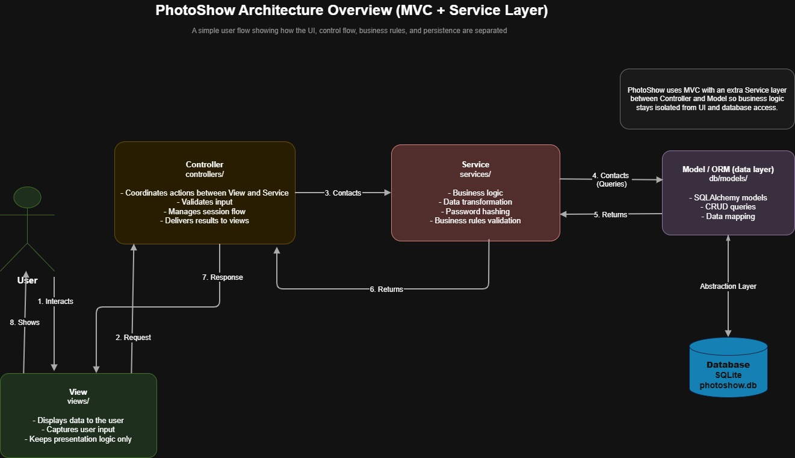
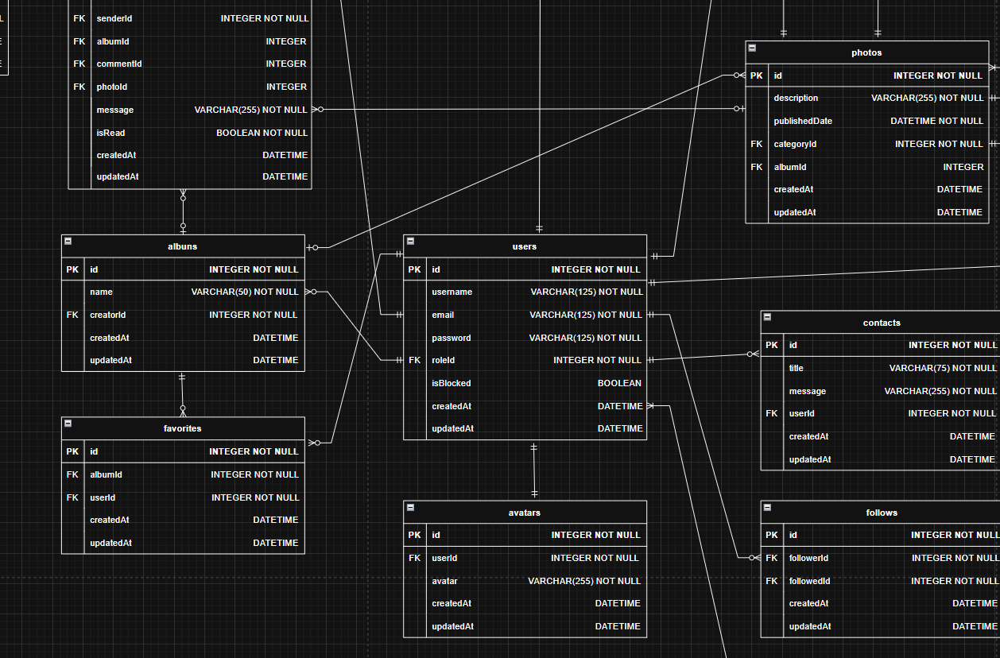

<a name="top"></a>

<div align="center" id="top">
  <p>
    
  </p>

  <p>
    <em>Every Pixel Tells a Tale</em>
  </p>

  <p>
    <a href="https://github.com/pedromst2000/PhotoShow/issues/new?labels=bug">Report Bug</a>
    ·
    <a href="https://github.com/pedromst2000/PhotoShow/issues/new?labels=enhancement">Request Feature</a>
  </p>
</div>

<br>

## :bookmark_tabs: Table of Contents

- [:bulb: About](#bulb-about)
- [:clapper: Demo Video](#clapper-demo-video)
- [:computer: Tech Stack](#computer-tech-stack)
- [:triangular_ruler: Architecture & Data Model](#triangular_ruler-architecture--data-model)
  - [:classical_building: Architecture](#classical_building-architecture)
  - [:card_file_box: Data Model](#card_file_box-data-model)
- [:rocket: Getting Started](#rocket-getting-started)
  - [:clipboard: Prerequisites](#clipboard-prerequisites)
  - [:inbox_tray: Quick Start](#inbox_tray-quick-start)
  - [:floppy_disk: Database Setup](#floppy_disk-database-setup)
- [:test_tube: Linting & Formatting](#test_tube-linting--formatting)
- [:hammer_and_wrench: Standalone Executable](#hammer_and_wrench-standalone-executable)
- [:handshake: Contributing](#handshake-contributing)
  - [:memo: Naming Conventions](#memo-naming-conventions)
  - [:arrows_counterclockwise: Contribution Workflow](#arrows_counterclockwise-contribution-workflow)
- [:page_facing_up: License](#page_facing_up-license)

<br>

## :bulb: About

PhotoShow is a lightweight local desktop app for organizing, viewing, and sharing photo collections. Users can sign in to access personalized and role-based features.

**:sparkles: Key features**:

- :camera: Organize and browse albums and photos
- :bust_in_silhouette: Personalize your profile, avatar, and favorites
- :speech_balloon: Comment, rate, like, follow, and receive notifications
- :shield: Admin moderation and user management

## :clapper: Demo Video

A demo video for PhotoShow will be added soon.

<br>

## :computer: Tech Stack

### :gear: Core Application

- [Python 3.14.3](https://www.python.org/) — Main programming language
- [Tkinter](https://docs.python.org/3/library/tkinter.html) — GUI framework
- [Pillow](https://pillow.readthedocs.io/en/stable/) — Image processing library

### :floppy_disk: Data & Security

- [SQLite](https://www.sqlite.org/) — Embedded relational database
- [SQLAlchemy](https://www.sqlalchemy.org/) — ORM and database toolkit
- [bcrypt](https://github.com/pyca/bcrypt) — Password hashing

### :wrench: Code Quality & Linting

- [Black](https://black.readthedocs.io/en/stable/) — Code formatter
- [flake8](https://flake8.pycqa.org/en/latest/) — Code linter
- [isort](https://pycqa.github.io/isort/) — Import sorter
- [yamllint](https://yamllint.readthedocs.io/en/stable/) — YAML linter

### :test_tube: Testing

- [pytest](https://docs.pytest.org/en/stable/) — Testing framework
- [pytest-cov](https://pytest-cov.readthedocs.io/en/latest/) — Coverage reporting
- [pytest-mock](https://github.com/pytest-dev/pytest-mock) — Mocking in tests

### :package: Packaging

- [PyInstaller](https://www.pyinstaller.org/) — Build standalone executables

<br>

## :triangular_ruler: Architecture & Data Model

### :classical_building: Architecture

> :warning: The preview below may be slightly outdated and will be refreshed in a later update.

[](./docs/images/MVC_PHOTOSHOW.jpg)



### :card_file_box: Data Model

> :warning: The preview below may be slightly outdated and will be refreshed in a later update.

<div align="center">
  <p>
    <br>
    <a href="https://viewer.diagrams.net/?tags=%7B%7D&lightbox=1&highlight=0000ff&edit=_blank&layers=1&nav=1&title=DER_PHOTOSHOW.drawio&dark=auto#Uhttps%3A%2F%2Fdrive.google.com%2Fuc%3Fid%3D1mwGO-kwEJU-898KxfPnKxffRPsdYXHc4%26export%3Ddownload" target="_blank" rel="noopener noreferrer">
      
    </a>
  </p>
  <p>
    <a href="https://viewer.diagrams.net/?tags=%7B%7D&lightbox=1&highlight=0000ff&edit=_blank&layers=1&nav=1&title=DER_PHOTOSHOW.drawio&dark=auto#Uhttps%3A%2F%2Fdrive.google.com%2Fuc%3Fid%3D1mwGO-kwEJU-898KxfPnKxffRPsdYXHc4%26export%3Ddownload" target="_blank" rel="noopener noreferrer">
      
    </a>
  </p>
</div>

ORM models live in `app/core/db/models/` and cover `users`, `roles`, `avatars`, `albums`, `photos`, `image files`, `ratings`, `comments`, `favorites`, `contacts`, `notification types`, `notifications`, `follows`, and `likes`.

<br>

## :rocket: Getting Started

### :clipboard: Prerequisites

- **Python 3.14.3** — Main programming language ([download](https://www.python.org/downloads/))
- **pip** — comes with Python
- **Git** — for cloning ([download](https://git-scm.com/downloads))
- (Recommended) Virtual environment support: `python -m venv`

> Verify your tools are available in the PATH:
>
> ```bash
> python --version
> pip --version
> git --version
> ```

### :inbox_tray: Quick Start

#### Clone the repository

```bash
git clone https://github.com/pedromst2000/PhotoShow.git
cd PhotoShow
```

> :bulb: **Tip:** Can't find the project directory? Open the folder in your code editor and use the integrated terminal.

#### Create and activate a virtual environment

Create the virtual environment:

```bash
python -m venv .venv
```

Activate it on **Windows PowerShell**:

```powershell
.venv\Scripts\Activate
```

Activate it on **macOS/Linux**:

```bash
source .venv/bin/activate
```

> **To deactivate the virtual environment:**
>
> - On any OS, simply run:

```bash
deactivate
```

This will return you to your system's default Python environment.

> **Note:** Some dependencies may only work correctly inside the `.venv` virtual environment. It is highly recommended to use the virtual environment for all development and testing.

#### Install dependencies

```bash
python -m pip install --upgrade pip
pip install --upgrade -r dev-requirements.txt
```

#### Run the app

```bash
python main.py
```

### :floppy_disk: Database Setup

`photoshow.db` is created automatically at the project root on first run. It is empty by default — use the commands below to create, seed, or restore data.

**Start (create schema if missing)**

```bash
python main.py
```

**Reset (backup current DB, wipe and reseed from CSV files)**

```bash
python main.py --resetDB
```

**Restore the latest backup**

```bash
python main.py --restoreDB
```

**Restore a specific backup**

```bash
python main.py --restoreDB backups/<folder>
```

> :warning: Backup folders may contain sensitive data (emails, password hashes). Keep them local and out of version control.

<br>

## :test_tube: Linting & Formatting

The main development checks are the linting, formatting, and staged-file commands below:

| Command                                           | Description              |
| ------------------------------------------------- | ------------------------ |
| `python app/scripts/lint_csv.py`                  | Lint CSV file formatting |
| `python app/scripts/format_csv.py`                | Auto-format CSV files    |
| `python app/scripts/check_imports.py`             | Check import ordering    |
| `python app/scripts/format_imports.py`            | Auto-format imports      |
| `python -m flake8 .`                              | Lint Python code         |
| `python -m black .`                               | Format Python code       |
| `python -m yamllint .`                            | Lint YAML files          |
| `python app/scripts/check_changed_files.py`       | Check staged changes     |
| `python app/scripts/check_changed_files.py --fix` | Auto-fix staged files    |

<br>

## :hammer_and_wrench: Standalone Executable

Standalone executable instructions will be added soon.

<br>

## :handshake: Contributing

Your contributions help improve PhotoShow! Whether you're fixing a bug, improving the UI, or adding a new feature — every contribution matters.

- Found a bug? [Report it](https://github.com/pedromst2000/PhotoShow/issues/new?labels=bug)
- Have an enhancement idea? [Suggest it](https://github.com/pedromst2000/PhotoShow/issues/new?labels=enhancement)
- Ready to code? Follow the workflow below

### :memo: Naming Conventions

Follow these conventions for branches and commit messages:

| Type       | Purpose            | Branch Example           | Commit Example                    |
| ---------- | ------------------ | ------------------------ | --------------------------------- |
| `feat`     | New feature        | `feat/photo-grid`        | `feat: add photo grid view`       |
| `fix`      | Bug fix            | `fix/login-validation`   | `fix: resolve login error`        |
| `docs`     | Documentation      | `docs/update-readme`     | `docs: update installation steps` |
| `refactor` | Code restructuring | `refactor/album-service` | `refactor: simplify album logic`  |
| `test`     | Testing            | `test/auth-tests`        | `test: add auth unit tests`       |
| `ci`       | CI/CD pipelines    | `ci/add-lint-workflow`   | `ci: add lint workflow`           |
| `chore`    | Maintenance        | `chore/update-deps`      | `chore: update dependencies`      |

### :arrows_counterclockwise: Contribution Workflow

1. **Fork** the repository and clone your fork
2. **Create a branch:**
   ```bash
   git checkout -b <type>/<short-description>
   ```
3. **Make your changes**
4. **Commit:**
   ```bash
   git commit -m "<type>: <short description>"
   ```
5. **Push:**
   ```bash
   git push origin <type>/<short-description>
   ```
6. **Open a Pull Request**

**PR checklist:**

- :white_check_mark: Title follows naming conventions
- :white_check_mark: Description explains changes clearly
- :white_check_mark: Passes all linting and formatting checks
- :white_check_mark: No merge conflicts

Thanks for contributing! :tada:

## :page_facing_up: License

This project is licensed under the MIT License. See [LICENSE](LICENSE) for details.

<p align="center">
  <a href="#top">Back to top</a>
</p>
